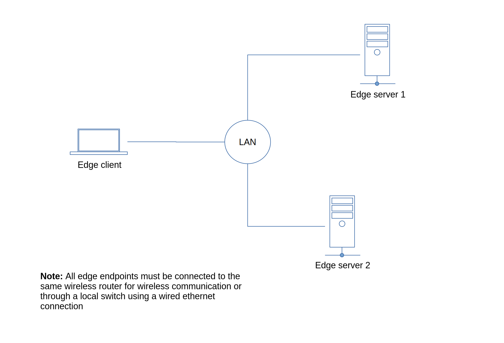

## Using M2M to provision publish/subscribe edge devices communicating through a private local area network

<br>

In this example, we will setup pub/sub endpoint devices communicating with each other through a local area network using tcp. 

The devices are also accessible from the cloud so you can configure and develop your applications from a browser interface. 



## Edge Server 1 Setup

### 1. Create a project directory and install m2m.
```js
$ npm install m2m
```
### 2. Save the code below as device.js in your project directory.
```js
const { edge, createDevice } = require('m2m');

// simulated voltage data source
function voltageSource(){
  return 50 + Math.floor(Math.random() * 10);
}

/***
 * edge tcp server 1
 */
    
let port = 8125;		// port must be open from your endpoint
let host = '192.168.0.113'; 	// use the actual ip of your endpoint

edge.createServer(port, host, (server) => {
  console.log('tcp server started :', host, port);
  server.publish('edge-voltage', (data) => {
     let vs = voltageSource();
     data.polling = 6000; 	// polling interval to check data source for any changes
     data.send(vs);
  });
});

/***
 * m2m device server 1
 */
 
let id = 100; // simply create your unique deviceId instead of ip address
let device = createDevice(id);

device.connect(() => {
    device.publish('m2m-voltage', (data) => {
      let vs = voltageSource();
      data.send(vs);
    });
});

```
### 3. Start your application.
```js
$ node device.js
```

## Edge Server 2 Setup

### 1. Create a project directory and install m2m.
```js
$ npm install m2m
```
### 2. Save the code below as device.js in your project directory.
```js
const { edge, createDevice } = require('m2m');

// simulated temperature sensor data source
function tempSource(){
  return 20 + Math.floor(Math.random() * 4);
}

/***
 * edge tcp server 2
 */
    
let port = 8125;		// port must be open from your endpoint
let host = '192.168.0.142'; 	// use the actual ip of your endpoint

edge.createServer(port, host, (server) => {
  console.log('tcp server started :', host, port);
  server.publish('edge-temperature', (data) => {
     let ts = tempSource();
     data.polling = 9000; 	// polling interval to check data source for any changes
     data.send(ts);
  });
});

/***
 * m2m device server
 */
 
let id = 200;  
let device = createDevice(id);

device.connect(() => {
    device.publish('m2m-temperature', (data) => {
      let ts = tempSource();
      data.send(ts);
    });
});

```
### 3. Start your application.
```js
$ node device.js
```

## Edge and M2M Client Setup

### 1. Create a project directory and install m2m.
```js
$ npm install m2m
```
### 2. Save the code below as client.js in your project directory.
```js
const { edge, createClient } = require('m2m'); 

let client = createClient();

client.connect(() => {

    /***
     * edge tcp client (access edge servers using a private local network)
     */
     
    let ec1 = new edge.client(8125, '192.168.0.113')
    
    ec1.subscribe('edge-voltage', (data) => {
      console.log('edge server 1 voltage', data);
    });

    let ec2 = new edge.client(8125, '192.168.0.142')
    
    ec2.subscribe('edge-temperature', (data) => {
      console.log('edge server 2 temperature', data);
    });
    
        
    /***
     * m2m client (access m2m devices using a public internet)
     */
    
    client.subscribe({id:100, channel:'m2m-voltage'}, (data) => { // subscribe from m2m device 100
      console.log('device 100 voltage', data);
    });
   
    client.subscribe({id:200, channel:'m2m-temperature'}, (data) => {  // subscribe from m2m device 200
      console.log('device 200 temperature', data);
    });

});

```
### 3. Start your application.
```js
$ node client.js
```

### 4. The expected output should be similar as shown below.
```js
$

edge server 1 voltage 16
device 200 temperature 25
device 100 voltage 9
edge server 2 temperature 25

```
